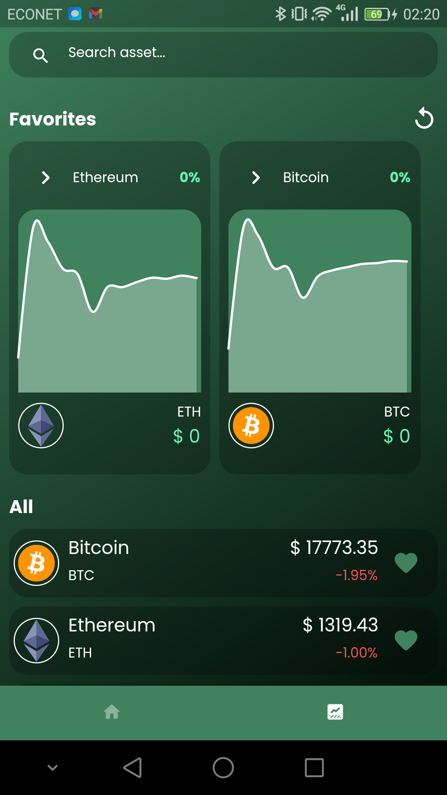

# xcrypt
This is a blockchain wallet created with flutter which allows you to create and manage your crypto wallets. 
It also allows you to transact on the blockchain securely and safely. The app is currently running on the sepolia dev net. It still contains bugs (work in progress)

web3dart is the library for communicating with the blockchain and in Infura is providing the rpc endpoint to the 
ethereum node! xcrypt also features crypto price tracking with Minute, Hour and Daily price charts.

to be able to use the application you need to get sepolia dev net Eth coins from here (https://faucet.sepolia.dev)

## Work in progress
- Messaging feature in currenlty in development ready for testing soon
- You might experience errors with some values in the amount for transaction issue is random still tracking the cause!

## Screenshots

### Home without existig wallet

### Home with new wallet

### Crypto prices

### Crypto price chart

